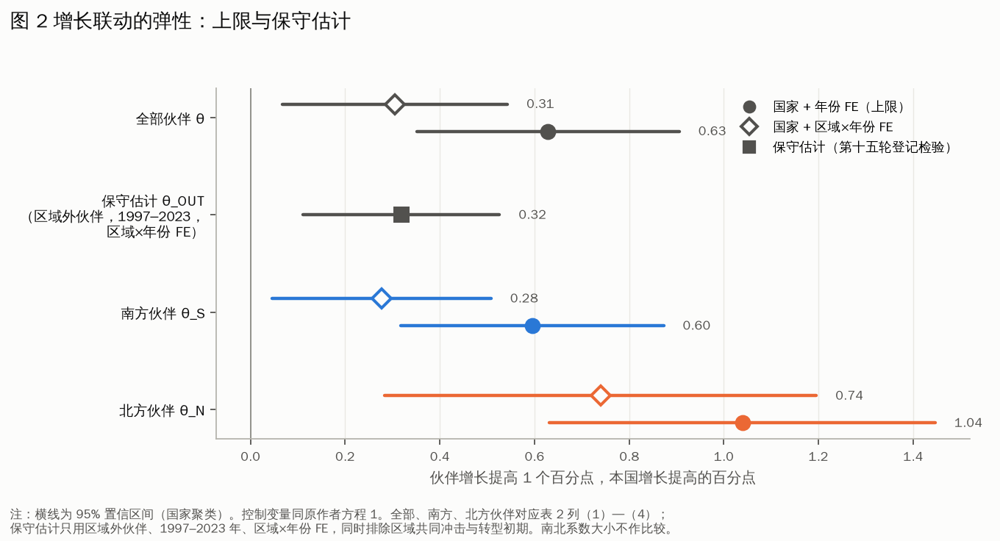
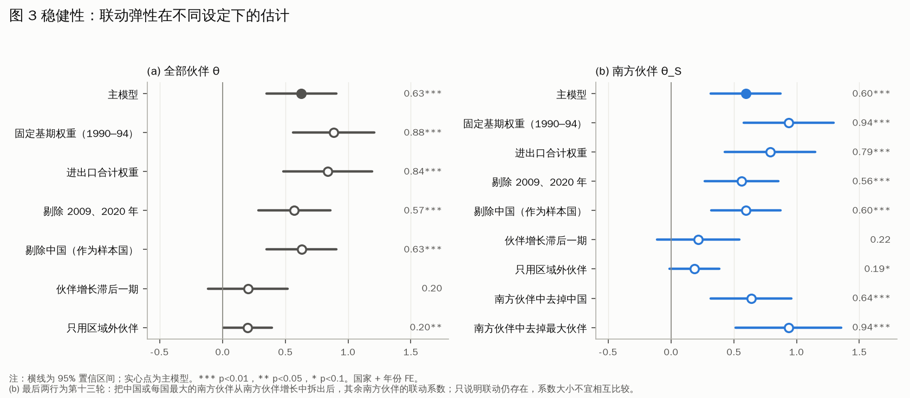
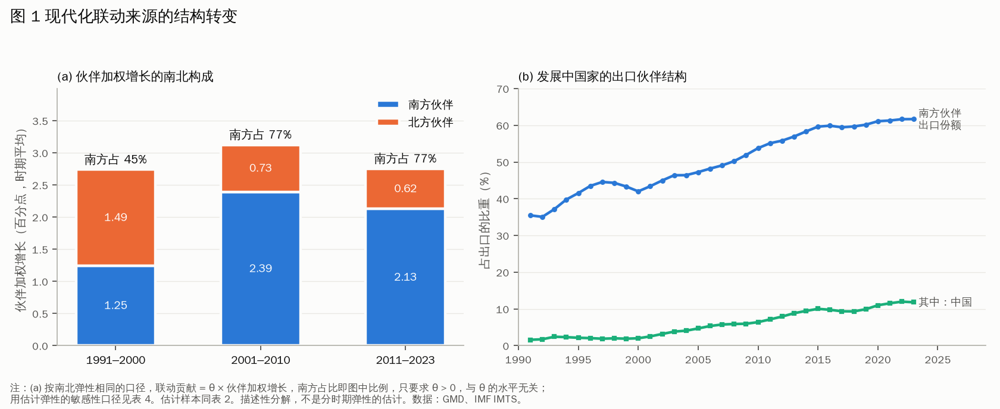
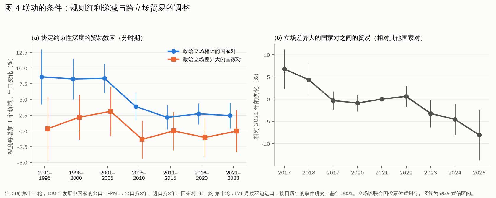

# 初步研究报告：开放条件下的现代化联动及其结构转型

**日期**：2026-09-25
**对应大纲**：`docs/cn_paper_outline.md`（第三版）
**核心检验**：第十二轮事前登记（`docs/preregistration12.md`，提交 `aaa3283`），结果对照见 `docs/results_vs_prereg12.md`
**代码**：`code/50_growth_linkage.py`（登记检验）、`code/51_linkage_decomposition.py`（描述性分解）、`code/52_linkage_paper_figures.py`（论文图表）

---

## 摘要

经典现代化理论将各国现代化视为彼此独立、沿同一阶梯攀升的单元过程；依附论虽关注国家间关系，却将其理解为中心对外围的等级性带动。本报告基于 117 个发展中国家 1991—2023 年的面板数据，在 Aizenman 等人的增长方程中引入贸易伙伴加权增长，得到四项发现：

1. 伙伴增长对本国增长存在稳健的联动效应，弹性约 0.63；控制区域共同冲击后约 0.31。
2. 南方伙伴的增长同样带动本国增长，弹性约 0.60，但单位强度低于北方伙伴（约 1.04）。
3. 随着南南经贸关系的扩展，南方已成为联动的主要来源，其贡献占比由 1990 年代的约三分之一升至 21 世纪以来的约三分之二。
4. 联动以实际经济关系为载体，区域性较强；贸易协定规则深度的独立作用有限，并逐步递减。

所有核心检验均先登记、后估计。

---

## 一、研究问题

开放条件下，一国现代化在多大程度上取决于其他国家的现代化？这种依存是否只来自中心国家？

三类理论对此各有盲点：

| 理论 | 预设 | 本研究检验的对照命题 |
|---|---|---|
| 经典现代化理论 | 各国是独立单元 | 伙伴增长是否带动本国增长（L1） |
| 依附论、世界体系论 | 带动来自中心，关系是等级性的 | 南方伙伴的增长是否同样带动本国增长（L4） |
| 多元现代性理论 | 路径多样，分析单位是单个国家 | 关系结构的变化是否改变联动的来源（结构分解） |

## 二、理论框架

一国从伙伴处得到的联动贡献，可以分解为三个因素的乘积：

**联动贡献 = 联动强度 θ × 关系密度（贸易份额）× 伙伴增长**

由此推出：
- 只要南方在贸易关系中的份额上升、增长更快，即使南方的单位联动强度低于北方，**联动来源也会转向南方**；
- 结构转型不以「南北平等」为前提。

## 三、数据与方法

| 项目 | 设定 |
|---|---|
| 样本 | 117 个发展中国家，1991–2023 年，3,565 个观测 |
| 方程 | 原作者方程 1：g_it = φ g_i,t−1 + ρ ln y_i,t−1 + β X_i,t−1 + θ g^P_it + μ_i + τ_t + ε_it |
| 控制变量 X | 投资率、ln 人口、人口增长率、通胀、协定数量，全部滞后一期 |
| 伙伴增长 g^P | Σ w_ij g_j，权重为 t−3 至 t−1 年出口份额的平均（前定权重） |
| 南北分解 | g^P = g^S + g^N；北方为 23 个高收入经济体，中国计入南方 |
| 固定效应 | 国家 + 年份；另报国家 + 区域×年份 |
| 推断 | 国家聚类标准误；Holm 多重检验校正；置换检验（200 次） |
| 数据 | GMD（增长、控制变量、开放度）；IMF IMTS（双边贸易） |

**描述统计**（表 1，`output/tables/tab40_linkage_descriptives.md`）：

| 变量 | 均值 | 标准差 |
|---|---|---|
| 实际 GDP 增长率 | 0.035 | 0.067 |
| 伙伴加权增长 g^P | 0.029 | 0.024 |
| 南方伙伴增长 g^S | 0.020 | 0.020 |
| 北方伙伴增长 g^N | 0.009 | 0.011 |
| 对华出口份额 | 0.062 | 0.118 |

## 四、主要结果

### 1. 联动存在，南南联动存在（表 2、图 2）

| | (1) | (2) | (3) | (4) |
|---|---|---|---|---|
| 伙伴加权增长 g^P | **0.629***（0.142） | **0.305**（0.121） | | |
| 南方伙伴增长 g^S | | | **0.595***（0.142） | **0.277**（0.118） |
| 北方伙伴增长 g^N | | | 1.039***（0.208） | 0.739***（0.233） |
| θ_S − θ_N | | | −0.444** | −0.462** |
| 年份 FE | 是 | 否 | 是 | 否 |
| 区域×年份 FE | 否 | 是 | 否 | 是 |
| 观测数 | 3,565 | 3,565 | 3,565 | 3,565 |

完整表格见 `output/tables/tab41_linkage_main.md`。*** p<0.01，** p<0.05。

- 伙伴增长提高 1 个百分点，本国增长提高约 0.63 个百分点；控制区域共同冲击后约 0.31。
- **置换检验**：随机打乱伙伴权重 200 次，系数平均约 0，第 95 百分位为 0.10；真实系数 0.63 远高于此。
- **登记判定**：L1、L4 均为「稳健支持」（Holm 校正后 p < 0.001，区域×年份 FE 下仍显著）。

### 2. 稳健性（表 3、图 3）

| 设定 | 全部伙伴 θ | 南方伙伴 θ_S |
|---|---|---|
| 主模型 | 0.63*** | 0.60*** |
| 固定基期权重（1990–94） | 0.88*** | 0.94*** |
| 进出口合计权重 | 0.84*** | 0.79*** |
| 剔除 2009、2020 年 | 0.57*** | 0.56*** |
| 剔除中国（作为样本国） | 0.63*** | 0.60*** |
| 南方伙伴中去掉中国（第十三轮） | — | 0.64*** |
| 南方伙伴中去掉各国最大南方伙伴（第十三轮） | — | 0.94*** |
| 伙伴增长滞后一期 | 0.20 | 0.22 |
| 只用区域外伙伴 | 0.20** | 0.19* |

- 前五种设定都稳健。「剔除中国（作为样本国）」只是把中国从 117 个样本国中去掉，中国仍在伙伴权重里；真正检验「是否依赖中国」的是第十三轮的两项（见下文第 3 节）。
- **两项减弱需要如实报告**：
  - 联动是**同期的**：伙伴增长滞后一期后不显著；
  - 联动的**区域性较强**：只用区域外伙伴时约为 0.20。

### 3. 联动来源的结构转型（表 4、图 1）

| 时期 | 北方贡献（百分点） | 南方贡献（百分点） | 南方占比 |
|---|---|---|---|
| 1991–2000 | 1.51 | 0.74 | **33%** |
| 2001–2010 | 0.76 | 1.42 | **65%** |
| 2011–2023 | 0.65 | 1.26 | **66%** |

- 同期，南方伙伴在发展中国家出口中的份额由约 35% 升至约 62%，其中对华份额由约 2% 升至约 12%。
- **性质**：描述性分解，假定弹性在各时期相同。登记检验 L3 没有发现联动弹性随时期上升，所以这一前提与数据不冲突。
- **联动是多源的**（第十三轮登记检验，`docs/results_vs_prereg13.md`）：
  - 把中国从南方伙伴增长中拆出后，其余南方伙伴的联动为 0.64（p < 0.001；区域×年份 FE 下 0.30，p = 0.033）；
  - 把各国最大的南方伙伴拆出后为 0.94（p < 0.001；区域×年份 FE 下 0.51，p = 0.020）；
  - 两项均为「稳健支持」。南南联动不依赖中国或任何单一南方大国，没有形成新的单一中心。
  - 这两项只说明「拆出后其余南方伙伴的联动仍然存在」，**系数大小不宜相互比较**。分散组合更贴近共同冲击，而且最大伙伴与其余伙伴的系数差异没有检验过。
  - 中国的单位联动系数估计不精确（0.26，SE 0.22），不宜单独解读。

### 4. 延伸假设（未获支持或仅为提示性）

| 假设 | 结果 | 判定 |
|---|---|---|
| L2 开放度越高，联动越强 | 0.225，原始 p = 0.023，Holm 校正后 p = 0.068 | 提示性证据 |
| L3 联动弹性随时期上升 | 1991–2000 年 0.73，2001–2023 年 0.55 | 不支持 |
| L5 对华依存度 × 中国增长 | −0.03，p = 0.93 | 未检测到（中国增长波动较小，检验力可能不足） |

### 5. 联动的条件（图 4，第十、十一轮）

- **规则红利递减**：约束性深度每增加一个领域，政治立场相近的国家对之间出口增加的幅度，由 1990 年代的约 8% 降至 2006 年以后的约 2.5%；在立场差异大的国家对之间始终接近 0。
- **RCEP**：生效后四年内未检测到显著的贸易增量，95% 上限约 4%。
- **跨立场贸易的调整**：立场差异大的国家对之间的贸易，相对 2021 年，2017 年高约 7%，2025 年低约 8%。

---

## 五、初步结论

1. **联动存在**：各国现代化不是彼此独立的单元过程。
2. **南南联动存在**：带动并非只来自中心国家；但单位强度上，南北差异仍在。
3. **结构转型**：南方已成为联动的主要来源，约占三分之二。变化来自关系结构（份额与增长），而不是联动强度。**南南联动是多源的**：拆出中国或各国最大的南方伙伴后，其余南方伙伴的联动依然稳健。
4. **联动的条件**：以实际经济关系为载体，区域性强；制度规则需要落到实际关系上才能发挥作用。

**理论含义**：世界现代化的联动结构正在由「中心带动」向「多元联动」转型。这一转型正在进行，但尚未完成。这为「关系性认知」提供了经验支撑，同时补充了它的条件。

## 六、局限与下一步

**局限**：
1. 同期联动不能完全排除共同冲击；年份 FE、区域×年份 FE 和置换检验只能缓解；
2. 联动的区域性较强，区域外联动的证据较弱；
3. 中国专项的带动效应未识别；
4. 仅用 GDP 增长率刻画现代化。

**下一步**：
1. 按大纲撰写正文初稿；
2. 补充文献：增长溢出、依附论与世界体系论、关系理论；
3. 可选的补充检验（需先登记）：用制造业份额、出口复杂度等结构变量，区分「共生」与「新的依附」。

---

## 附：研究透明度

本研究共进行十二轮事前登记检验，全部结果（包括零结果与证伪结果）记录于 `docs/falsification_log.md`。第十三轮的两项检验（南南联动的多源性）均获得稳健支持。第十二轮的五项检验中：
- 两项获得稳健支持（L1、L4）；
- 一项为提示性证据（L2）；
- 两项未获支持（L3、L5）。
