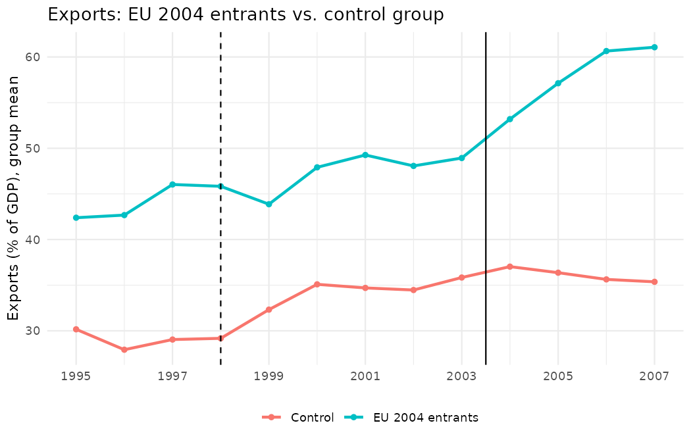
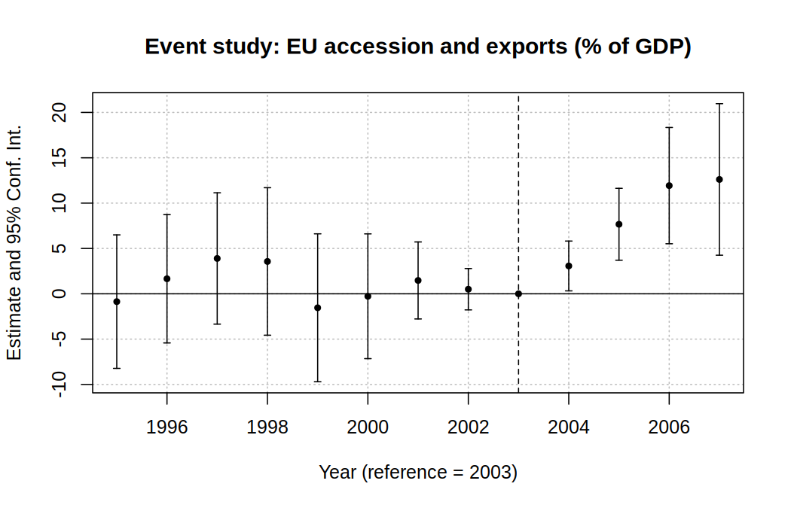

# 计量入门练习

给国际关系、国际政治经济学背景的计量入门者准备的 R 练习。数据都是国家-年份面板，问题来自区域国别研究。

## 练习 01：固定效应与双重差分

文件：`01_fe_and_did.R`，参考答案：`answers.md`

**第一部分：固定效应。** 用 217 个国家 1995–2019 年的数据，看贸易开放度和人均收入的关系。分别跑混合 OLS、国家固定效应、国家 + 年份双向固定效应，系数从 0.88 一路降到 0.05。你会看到遗漏变量偏误有多大，以及固定效应到底在比较什么。

**第二部分：双重差分。** 2004 年加入欧盟，有没有让中东欧国家的出口增加？

- 处理组：捷克、爱沙尼亚、匈牙利、拉脱维亚、立陶宛、波兰、斯洛伐克、斯洛文尼亚
- 对照组：阿尔巴尼亚、亚美尼亚、波黑、白俄罗斯、格鲁吉亚、克罗地亚、摩尔多瓦、北马其顿、俄罗斯、塞尔维亚、乌克兰
- 窗口：1995–2007 年

练习从画图、手算 2×2 DiD 开始，然后用回归复现同一个数，再做事件研究。结果是入盟后出口占 GDP 的比重相对多涨了约 7.9 个百分点。





脚本里有十几道思考题和 4 个动手练习：换结果变量、换对照组、安慰剂检验、交错 DiD。很多问题需要区域知识才能回答，比如 1998 年俄罗斯金融危机、1999 年科索沃战争对对照组的影响。

## 怎么运行

1. 安装 [R](https://cran.r-project.org/) 和 [RStudio](https://posit.co/download/rstudio-desktop/)。
2. 在 RStudio 里打开 `01_fe_and_did.R`，把工作目录设为本文件夹：菜单 **Session > Set Working Directory > To Source File Location**。
3. 安装需要的包（只需一次）：
   ```r
   install.packages(c("fixest", "dplyr", "ggplot2"))
   ```
4. **一段一段地运行**（选中代码后按 Ctrl/Cmd + Enter）。遇到思考题先停下来自己回答，再看 `answers.md`。

## 文件

| 文件 | 内容 |
|---|---|
| `01_fe_and_did.R` | 练习脚本，中文注释 |
| `answers.md` | 思考题和动手练习的参考答案 |
| `data/wdi_panel.csv` | 世界银行 WDI 数据，217 个国家 × 1990–2019 年，2026 年 10 月下载 |
| `data/download_wdi.R` | 重新下载或换指标时用，平时不需要运行 |
| `output/` | 脚本生成的图 |

数据包括：出口占 GDP 的比重、FDI 净流入占 GDP 的比重、人均 GDP（2015 年不变价美元）、人均 GDP 增长率、贸易开放度。

数据来源：World Bank, World Development Indicators，按 [CC BY 4.0](https://datacatalog.worldbank.org/public-licenses#cc-by) 许可使用。

## 和 Claude 一起学

本仓库的 `.claude/skills/` 里装了计量相关的技能，在这个仓库里用 Claude Code 时会自动加载。学习时建议这样问：

- "先别给代码，问我这个设计的识别假设是什么"
- "我的答案是……，哪里不对？"
- "逐行解释这段回归代码的输出"

相关阅读：`.claude/skills/econ-write/identification-strategies.md` 讲各种识别策略的直觉；`.claude/skills/scientific-critical-thinking/references/statistical_pitfalls.md` 列出常见统计误区。
